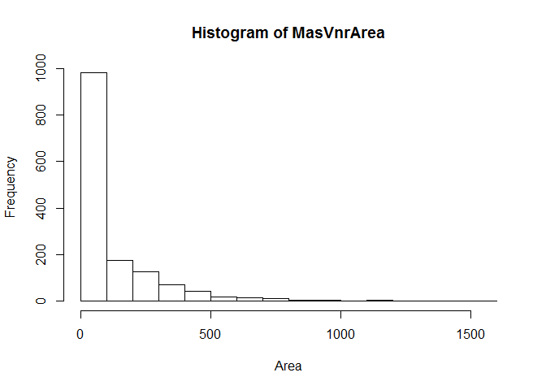
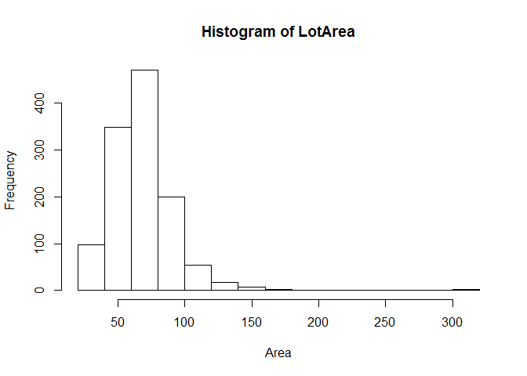
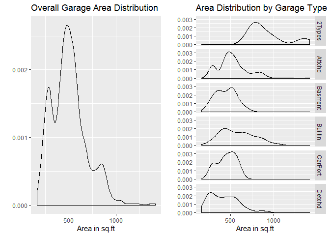
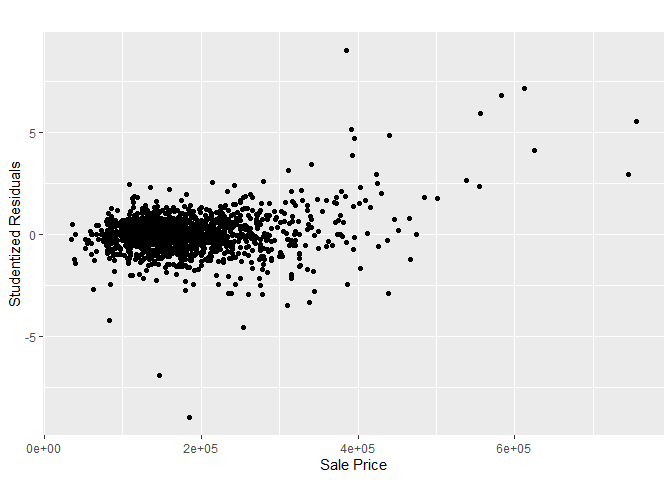
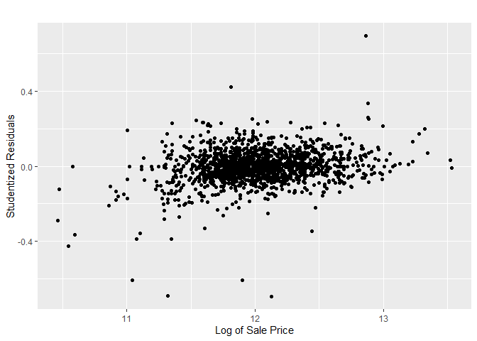
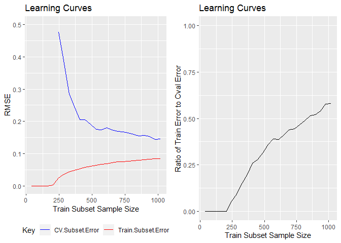

-   [Pre-processing Data, Exploratory Data Analysis & Imputing Missing
    Data](#pre-processing-data-exploratory-data-analysis-imputing-missing-data)
    -   [Getting the Data](#getting-the-data)
    -   [Pre-Process - I](#pre-process---i)
    -   [Pre-Process - II](#pre-process---ii)
    -   [Exploratory Data Analysis - I](#exploratory-data-analysis---i)
    -   [Impute Missing Data - I](#impute-missing-data---i)
    -   [Exploratory Data Analysis -
        II](#exploratory-data-analysis---ii)
    -   [Exploratory Data Analysis -
        III](#exploratory-data-analysis---iii)
    -   [Impute Missing Data - II](#impute-missing-data---ii)
    -   [Saving a Baseline](#saving-a-baseline)
-   [Data Transformation and Learning
    Curves](#data-transformation-and-learning-curves)
    -   [Getting the Data](#getting-the-data-1)
    -   [Investigating Likely
        Heteroscedacity](#investigating-likely-heteroscedacity)
    -   [Identifying *Extreme* Examples](#identifying-extreme-examples)
    -   [Learning Curves](#learning-curves)
    -   [Saving a Baseline](#saving-a-baseline-1)
-   [Penalised Regression Models](#penalised-regression-models)
    -   [Introduction](#introduction)
    -   [Getting the Data](#getting-the-data-2)
    -   [Unpenalised Linear Regression](#unpenalised-linear-regression)
    -   [Ridge Penalised Linear
        Regression](#ridge-penalised-linear-regression)
    -   [Lasso Penalised Linear
        Regression](#lasso-penalised-linear-regression)
-   [Other Dimensionality Reducing Regression
    Models](#other-dimensionality-reducing-regression-models)
    -   [Introduction](#introduction-1)
    -   [Getting the Data](#getting-the-data-3)
        -   [Principal Component
            Regression](#principal-component-regression)
    -   [Partial Least Square
        Regression](#partial-least-square-regression)
    -   [Best Subset Selection - Forward
        Selection](#best-subset-selection---forward-selection)
    -   [Best Subset Selection - Backward
        Selection](#best-subset-selection---backward-selection)
-   [Tree Based Models](#tree-based-models)
    -   [Introduction](#introduction-2)
    -   [Getting the Data](#getting-the-data-4)
    -   [Random Forest Ensemble](#random-forest-ensemble)
    -   [Boosted Tree Ensemble](#boosted-tree-ensemble)
-   [Predictions](#predictions)
    -   [Introduction](#introduction-3)
    -   [Getting the Data](#getting-the-data-5)
    -   [Ridge Penalised Linear Regression -
        Predictions](#ridge-penalised-linear-regression---predictions)
    -   [Lasso Penalised Linear Regression
        Predictions](#lasso-penalised-linear-regression-predictions)
    -   [Partial Least Squares
        Regression](#partial-least-squares-regression)
    -   [Boosted Tree Ensemble](#boosted-tree-ensemble-1)
-   [Results](#results)

Loading the required libraries.

    library(knitr)
    library(dplyr)
    library(ggplot2)
    library(gridExtra)
    library(glmnet)
    library(pls)
    library(leaps)
    library(randomForest)
    library(gbm)

Loading required functions.

    na.count = function (dat){
      dat %>% apply(., 2, is.na) %>% apply(.,2,sum) %>% .[.!=0]
    }

### Pre-processing Data, Exploratory Data Analysis & Imputing Missing Data

#### Getting the Data

1.  We add a column `SalePrice` to the *test* dataset and assign a
    default value of "1000".
2.  We combide *train* and *test* datasets, for easier changes to the
    dataframe structure, imputing missing values and analysis.
3.  We start by getting a sense of the *train* dataset and its
    structure.

<!-- -->

    ## [1] "Sample examples from the train dataset"

    ##   Id MSSubClass MSZoning LotFrontage LotArea Street Alley LotShape
    ## 1  1         60       RL          65    8450   Pave  <NA>      Reg
    ## 2  2         20       RL          80    9600   Pave  <NA>      Reg
    ## 3  3         60       RL          68   11250   Pave  <NA>      IR1
    ## 4  4         70       RL          60    9550   Pave  <NA>      IR1
    ## 5  5         60       RL          84   14260   Pave  <NA>      IR1
    ## 6  6         50       RL          85   14115   Pave  <NA>      IR1
    ##   LandContour Utilities LotConfig LandSlope Neighborhood Condition1
    ## 1         Lvl    AllPub    Inside       Gtl      CollgCr       Norm
    ## 2         Lvl    AllPub       FR2       Gtl      Veenker      Feedr
    ## 3         Lvl    AllPub    Inside       Gtl      CollgCr       Norm
    ## 4         Lvl    AllPub    Corner       Gtl      Crawfor       Norm
    ## 5         Lvl    AllPub       FR2       Gtl      NoRidge       Norm
    ## 6         Lvl    AllPub    Inside       Gtl      Mitchel       Norm
    ##   Condition2 BldgType HouseStyle OverallQual OverallCond YearBuilt
    ## 1       Norm     1Fam     2Story           7           5      2003
    ## 2       Norm     1Fam     1Story           6           8      1976
    ## 3       Norm     1Fam     2Story           7           5      2001
    ## 4       Norm     1Fam     2Story           7           5      1915
    ## 5       Norm     1Fam     2Story           8           5      2000
    ## 6       Norm     1Fam     1.5Fin           5           5      1993
    ##   YearRemodAdd RoofStyle RoofMatl Exterior1st Exterior2nd MasVnrType
    ## 1         2003     Gable  CompShg     VinylSd     VinylSd    BrkFace
    ## 2         1976     Gable  CompShg     MetalSd     MetalSd       None
    ## 3         2002     Gable  CompShg     VinylSd     VinylSd    BrkFace
    ## 4         1970     Gable  CompShg     Wd Sdng     Wd Shng       None
    ## 5         2000     Gable  CompShg     VinylSd     VinylSd    BrkFace
    ## 6         1995     Gable  CompShg     VinylSd     VinylSd       None
    ##   MasVnrArea ExterQual ExterCond Foundation BsmtQual BsmtCond BsmtExposure
    ## 1        196        Gd        TA      PConc       Gd       TA           No
    ## 2          0        TA        TA     CBlock       Gd       TA           Gd
    ## 3        162        Gd        TA      PConc       Gd       TA           Mn
    ## 4          0        TA        TA     BrkTil       TA       Gd           No
    ## 5        350        Gd        TA      PConc       Gd       TA           Av
    ## 6          0        TA        TA       Wood       Gd       TA           No
    ##   BsmtFinType1 BsmtFinSF1 BsmtFinType2 BsmtFinSF2 BsmtUnfSF TotalBsmtSF
    ## 1          GLQ        706          Unf          0       150         856
    ## 2          ALQ        978          Unf          0       284        1262
    ## 3          GLQ        486          Unf          0       434         920
    ## 4          ALQ        216          Unf          0       540         756
    ## 5          GLQ        655          Unf          0       490        1145
    ## 6          GLQ        732          Unf          0        64         796
    ##   Heating HeatingQC CentralAir Electrical X1stFlrSF X2ndFlrSF LowQualFinSF
    ## 1    GasA        Ex          Y      SBrkr       856       854            0
    ## 2    GasA        Ex          Y      SBrkr      1262         0            0
    ## 3    GasA        Ex          Y      SBrkr       920       866            0
    ## 4    GasA        Gd          Y      SBrkr       961       756            0
    ## 5    GasA        Ex          Y      SBrkr      1145      1053            0
    ## 6    GasA        Ex          Y      SBrkr       796       566            0
    ##   GrLivArea BsmtFullBath BsmtHalfBath FullBath HalfBath BedroomAbvGr
    ## 1      1710            1            0        2        1            3
    ## 2      1262            0            1        2        0            3
    ## 3      1786            1            0        2        1            3
    ## 4      1717            1            0        1        0            3
    ## 5      2198            1            0        2        1            4
    ## 6      1362            1            0        1        1            1
    ##   KitchenAbvGr KitchenQual TotRmsAbvGrd Functional Fireplaces FireplaceQu
    ## 1            1          Gd            8        Typ          0        <NA>
    ## 2            1          TA            6        Typ          1          TA
    ## 3            1          Gd            6        Typ          1          TA
    ## 4            1          Gd            7        Typ          1          Gd
    ## 5            1          Gd            9        Typ          1          TA
    ## 6            1          TA            5        Typ          0        <NA>
    ##   GarageType GarageYrBlt GarageFinish GarageCars GarageArea GarageQual
    ## 1     Attchd        2003          RFn          2        548         TA
    ## 2     Attchd        1976          RFn          2        460         TA
    ## 3     Attchd        2001          RFn          2        608         TA
    ## 4     Detchd        1998          Unf          3        642         TA
    ## 5     Attchd        2000          RFn          3        836         TA
    ## 6     Attchd        1993          Unf          2        480         TA
    ##   GarageCond PavedDrive WoodDeckSF OpenPorchSF EnclosedPorch X3SsnPorch
    ## 1         TA          Y          0          61             0          0
    ## 2         TA          Y        298           0             0          0
    ## 3         TA          Y          0          42             0          0
    ## 4         TA          Y          0          35           272          0
    ## 5         TA          Y        192          84             0          0
    ## 6         TA          Y         40          30             0        320
    ##   ScreenPorch PoolArea PoolQC Fence MiscFeature MiscVal MoSold YrSold
    ## 1           0        0   <NA>  <NA>        <NA>       0      2   2008
    ## 2           0        0   <NA>  <NA>        <NA>       0      5   2007
    ## 3           0        0   <NA>  <NA>        <NA>       0      9   2008
    ## 4           0        0   <NA>  <NA>        <NA>       0      2   2006
    ## 5           0        0   <NA>  <NA>        <NA>       0     12   2008
    ## 6           0        0   <NA> MnPrv        Shed     700     10   2009
    ##   SaleType SaleCondition SalePrice
    ## 1       WD        Normal    208500
    ## 2       WD        Normal    181500
    ## 3       WD        Normal    223500
    ## 4       WD       Abnorml    140000
    ## 5       WD        Normal    250000
    ## 6       WD        Normal    143000

    ## [1] "Structure of the train dataset"

    ## 'data.frame':    1460 obs. of  81 variables:
    ##  $ Id           : int  1 2 3 4 5 6 7 8 9 10 ...
    ##  $ MSSubClass   : int  60 20 60 70 60 50 20 60 50 190 ...
    ##  $ MSZoning     : Factor w/ 5 levels "C (all)","FV",..: 4 4 4 4 4 4 4 4 5 4 ...
    ##  $ LotFrontage  : int  65 80 68 60 84 85 75 NA 51 50 ...
    ##  $ LotArea      : int  8450 9600 11250 9550 14260 14115 10084 10382 6120 7420 ...
    ##  $ Street       : Factor w/ 2 levels "Grvl","Pave": 2 2 2 2 2 2 2 2 2 2 ...
    ##  $ Alley        : Factor w/ 2 levels "Grvl","Pave": NA NA NA NA NA NA NA NA NA NA ...
    ##  $ LotShape     : Factor w/ 4 levels "IR1","IR2","IR3",..: 4 4 1 1 1 1 4 1 4 4 ...
    ##  $ LandContour  : Factor w/ 4 levels "Bnk","HLS","Low",..: 4 4 4 4 4 4 4 4 4 4 ...
    ##  $ Utilities    : Factor w/ 2 levels "AllPub","NoSeWa": 1 1 1 1 1 1 1 1 1 1 ...
    ##  $ LotConfig    : Factor w/ 5 levels "Corner","CulDSac",..: 5 3 5 1 3 5 5 1 5 1 ...
    ##  $ LandSlope    : Factor w/ 3 levels "Gtl","Mod","Sev": 1 1 1 1 1 1 1 1 1 1 ...
    ##  $ Neighborhood : Factor w/ 25 levels "Blmngtn","Blueste",..: 6 25 6 7 14 12 21 17 18 4 ...
    ##  $ Condition1   : Factor w/ 9 levels "Artery","Feedr",..: 3 2 3 3 3 3 3 5 1 1 ...
    ##  $ Condition2   : Factor w/ 8 levels "Artery","Feedr",..: 3 3 3 3 3 3 3 3 3 1 ...
    ##  $ BldgType     : Factor w/ 5 levels "1Fam","2fmCon",..: 1 1 1 1 1 1 1 1 1 2 ...
    ##  $ HouseStyle   : Factor w/ 8 levels "1.5Fin","1.5Unf",..: 6 3 6 6 6 1 3 6 1 2 ...
    ##  $ OverallQual  : int  7 6 7 7 8 5 8 7 7 5 ...
    ##  $ OverallCond  : int  5 8 5 5 5 5 5 6 5 6 ...
    ##  $ YearBuilt    : int  2003 1976 2001 1915 2000 1993 2004 1973 1931 1939 ...
    ##  $ YearRemodAdd : int  2003 1976 2002 1970 2000 1995 2005 1973 1950 1950 ...
    ##  $ RoofStyle    : Factor w/ 6 levels "Flat","Gable",..: 2 2 2 2 2 2 2 2 2 2 ...
    ##  $ RoofMatl     : Factor w/ 8 levels "ClyTile","CompShg",..: 2 2 2 2 2 2 2 2 2 2 ...
    ##  $ Exterior1st  : Factor w/ 15 levels "AsbShng","AsphShn",..: 13 9 13 14 13 13 13 7 4 9 ...
    ##  $ Exterior2nd  : Factor w/ 16 levels "AsbShng","AsphShn",..: 14 9 14 16 14 14 14 7 16 9 ...
    ##  $ MasVnrType   : Factor w/ 4 levels "BrkCmn","BrkFace",..: 2 3 2 3 2 3 4 4 3 3 ...
    ##  $ MasVnrArea   : int  196 0 162 0 350 0 186 240 0 0 ...
    ##  $ ExterQual    : Factor w/ 4 levels "Ex","Fa","Gd",..: 3 4 3 4 3 4 3 4 4 4 ...
    ##  $ ExterCond    : Factor w/ 5 levels "Ex","Fa","Gd",..: 5 5 5 5 5 5 5 5 5 5 ...
    ##  $ Foundation   : Factor w/ 6 levels "BrkTil","CBlock",..: 3 2 3 1 3 6 3 2 1 1 ...
    ##  $ BsmtQual     : Factor w/ 4 levels "Ex","Fa","Gd",..: 3 3 3 4 3 3 1 3 4 4 ...
    ##  $ BsmtCond     : Factor w/ 4 levels "Fa","Gd","Po",..: 4 4 4 2 4 4 4 4 4 4 ...
    ##  $ BsmtExposure : Factor w/ 4 levels "Av","Gd","Mn",..: 4 2 3 4 1 4 1 3 4 4 ...
    ##  $ BsmtFinType1 : Factor w/ 6 levels "ALQ","BLQ","GLQ",..: 3 1 3 1 3 3 3 1 6 3 ...
    ##  $ BsmtFinSF1   : int  706 978 486 216 655 732 1369 859 0 851 ...
    ##  $ BsmtFinType2 : Factor w/ 6 levels "ALQ","BLQ","GLQ",..: 6 6 6 6 6 6 6 2 6 6 ...
    ##  $ BsmtFinSF2   : int  0 0 0 0 0 0 0 32 0 0 ...
    ##  $ BsmtUnfSF    : int  150 284 434 540 490 64 317 216 952 140 ...
    ##  $ TotalBsmtSF  : int  856 1262 920 756 1145 796 1686 1107 952 991 ...
    ##  $ Heating      : Factor w/ 6 levels "Floor","GasA",..: 2 2 2 2 2 2 2 2 2 2 ...
    ##  $ HeatingQC    : Factor w/ 5 levels "Ex","Fa","Gd",..: 1 1 1 3 1 1 1 1 3 1 ...
    ##  $ CentralAir   : Factor w/ 2 levels "N","Y": 2 2 2 2 2 2 2 2 2 2 ...
    ##  $ Electrical   : Factor w/ 5 levels "FuseA","FuseF",..: 5 5 5 5 5 5 5 5 2 5 ...
    ##  $ X1stFlrSF    : int  856 1262 920 961 1145 796 1694 1107 1022 1077 ...
    ##  $ X2ndFlrSF    : int  854 0 866 756 1053 566 0 983 752 0 ...
    ##  $ LowQualFinSF : int  0 0 0 0 0 0 0 0 0 0 ...
    ##  $ GrLivArea    : int  1710 1262 1786 1717 2198 1362 1694 2090 1774 1077 ...
    ##  $ BsmtFullBath : int  1 0 1 1 1 1 1 1 0 1 ...
    ##  $ BsmtHalfBath : int  0 1 0 0 0 0 0 0 0 0 ...
    ##  $ FullBath     : int  2 2 2 1 2 1 2 2 2 1 ...
    ##  $ HalfBath     : int  1 0 1 0 1 1 0 1 0 0 ...
    ##  $ BedroomAbvGr : int  3 3 3 3 4 1 3 3 2 2 ...
    ##  $ KitchenAbvGr : int  1 1 1 1 1 1 1 1 2 2 ...
    ##  $ KitchenQual  : Factor w/ 4 levels "Ex","Fa","Gd",..: 3 4 3 3 3 4 3 4 4 4 ...
    ##  $ TotRmsAbvGrd : int  8 6 6 7 9 5 7 7 8 5 ...
    ##  $ Functional   : Factor w/ 7 levels "Maj1","Maj2",..: 7 7 7 7 7 7 7 7 3 7 ...
    ##  $ Fireplaces   : int  0 1 1 1 1 0 1 2 2 2 ...
    ##  $ FireplaceQu  : Factor w/ 5 levels "Ex","Fa","Gd",..: NA 5 5 3 5 NA 3 5 5 5 ...
    ##  $ GarageType   : Factor w/ 6 levels "2Types","Attchd",..: 2 2 2 6 2 2 2 2 6 2 ...
    ##  $ GarageYrBlt  : int  2003 1976 2001 1998 2000 1993 2004 1973 1931 1939 ...
    ##  $ GarageFinish : Factor w/ 3 levels "Fin","RFn","Unf": 2 2 2 3 2 3 2 2 3 2 ...
    ##  $ GarageCars   : int  2 2 2 3 3 2 2 2 2 1 ...
    ##  $ GarageArea   : int  548 460 608 642 836 480 636 484 468 205 ...
    ##  $ GarageQual   : Factor w/ 5 levels "Ex","Fa","Gd",..: 5 5 5 5 5 5 5 5 2 3 ...
    ##  $ GarageCond   : Factor w/ 5 levels "Ex","Fa","Gd",..: 5 5 5 5 5 5 5 5 5 5 ...
    ##  $ PavedDrive   : Factor w/ 3 levels "N","P","Y": 3 3 3 3 3 3 3 3 3 3 ...
    ##  $ WoodDeckSF   : int  0 298 0 0 192 40 255 235 90 0 ...
    ##  $ OpenPorchSF  : int  61 0 42 35 84 30 57 204 0 4 ...
    ##  $ EnclosedPorch: int  0 0 0 272 0 0 0 228 205 0 ...
    ##  $ X3SsnPorch   : int  0 0 0 0 0 320 0 0 0 0 ...
    ##  $ ScreenPorch  : int  0 0 0 0 0 0 0 0 0 0 ...
    ##  $ PoolArea     : int  0 0 0 0 0 0 0 0 0 0 ...
    ##  $ PoolQC       : Factor w/ 3 levels "Ex","Fa","Gd": NA NA NA NA NA NA NA NA NA NA ...
    ##  $ Fence        : Factor w/ 4 levels "GdPrv","GdWo",..: NA NA NA NA NA 3 NA NA NA NA ...
    ##  $ MiscFeature  : Factor w/ 4 levels "Gar2","Othr",..: NA NA NA NA NA 3 NA 3 NA NA ...
    ##  $ MiscVal      : int  0 0 0 0 0 700 0 350 0 0 ...
    ##  $ MoSold       : int  2 5 9 2 12 10 8 11 4 1 ...
    ##  $ YrSold       : int  2008 2007 2008 2006 2008 2009 2007 2009 2008 2008 ...
    ##  $ SaleType     : Factor w/ 9 levels "COD","Con","ConLD",..: 9 9 9 9 9 9 9 9 9 9 ...
    ##  $ SaleCondition: Factor w/ 6 levels "Abnorml","AdjLand",..: 5 5 5 1 5 5 5 5 1 5 ...
    ##  $ SalePrice    : int  208500 181500 223500 140000 250000 143000 307000 200000 129900 118000 ...

#### Pre-Process - I

1.  We change the data type for a few features to better align it with
    the type of feature data. Specifically, we convert `MSSubClass`,
    `OverallQual`, `OverallCond` from `<int>` to `<fctr>`.
2.  We identify the features in the *train* dataset that report `NA`
    values

<!-- -->

    ## [1] "Features in train dataset reporting NA values"

    ##  LotFrontage        Alley   MasVnrType   MasVnrArea     BsmtQual 
    ##          259         1369            8            8           37 
    ##     BsmtCond BsmtExposure BsmtFinType1 BsmtFinType2   Electrical 
    ##           37           38           37           38            1 
    ##  FireplaceQu   GarageType  GarageYrBlt GarageFinish   GarageQual 
    ##          690           81           81           81           81 
    ##   GarageCond       PoolQC        Fence  MiscFeature 
    ##           81         1453         1179         1406

**Observations**

Some features are *incorrectly* coded in that `NA` doesn't mean missing
data but has a an alternate meaning. We convert `NA` to a more
appropriate values for the following features:

1.  When a house has *No Alley Access*, it is recorded under the column
    `Alley` as `NA` which is corrected to `NoAccess`.
2.  When a house has *No Basement*, it is recorded under the columns
    `BsmtQual`, `BsmtCond`, `BsmtExposure`, `BsmtFinType1`,
    `BsmtFinType2` as `NA` which is corrected to `NoBsmt`.
3.  When a house has *No Fireplace*, it is recorded under the column
    `FireplaceQu` as `NA` which is corrected to `NoFpl`.
4.  When a house has *No Garage*, it is recorded under the columns
    `GarageType`, `GarageFinish`, `GarageQual`, `GarageCond` as `NA`
    which is corrected to `NoGrg`.
5.  When a house has *No Pool*, it is recorded under the column `PoolQc`
    as `NA` which is corrected to `NoPool`.
6.  When a house has *No Fence*, it is recorded under the column `Fence`
    as `NA` which is corrected to `NoFence`.
7.  When a house has *No Miscellaneous Features*, it is recorded under
    the column `MiscFeature` as `NA` which is corrected to `NoMisc`.

We apply these changes to both *train* and *test* datasets.

1.  We identify the features in the *train* dataset that are reporting
    `NA`.

#### Pre-Process - II

    ## [1] "Features in train dataset reporting NA values"

    ## LotFrontage  MasVnrType  MasVnrArea  Electrical GarageYrBlt 
    ##         259           8           8           1          81

#### Exploratory Data Analysis - I

We get additional visibility to the features in the *train* dataset
reporting `NA` values

    ## Property Ids reporting NA for GarageYrBlt

    ##        Id GarageType GarageYrBlt
    ## 40     40      NoGrg          NA
    ## 49     49      NoGrg          NA
    ## 79     79      NoGrg          NA
    ## 89     89      NoGrg          NA
    ## 90     90      NoGrg          NA
    ## 100   100      NoGrg          NA
    ## 109   109      NoGrg          NA
    ## 126   126      NoGrg          NA
    ## 128   128      NoGrg          NA
    ## 141   141      NoGrg          NA
    ## 149   149      NoGrg          NA
    ## 156   156      NoGrg          NA
    ## 164   164      NoGrg          NA
    ## 166   166      NoGrg          NA
    ## 199   199      NoGrg          NA
    ## 211   211      NoGrg          NA
    ## 242   242      NoGrg          NA
    ## 251   251      NoGrg          NA
    ## 288   288      NoGrg          NA
    ## 292   292      NoGrg          NA
    ## 308   308      NoGrg          NA
    ## 376   376      NoGrg          NA
    ## 387   387      NoGrg          NA
    ## 394   394      NoGrg          NA
    ## 432   432      NoGrg          NA
    ## 435   435      NoGrg          NA
    ## 442   442      NoGrg          NA
    ## 465   465      NoGrg          NA
    ## 496   496      NoGrg          NA
    ## 521   521      NoGrg          NA
    ## 529   529      NoGrg          NA
    ## 534   534      NoGrg          NA
    ## 536   536      NoGrg          NA
    ## 563   563      NoGrg          NA
    ## 583   583      NoGrg          NA
    ## 614   614      NoGrg          NA
    ## 615   615      NoGrg          NA
    ## 621   621      NoGrg          NA
    ## 636   636      NoGrg          NA
    ## 637   637      NoGrg          NA
    ## 639   639      NoGrg          NA
    ## 650   650      NoGrg          NA
    ## 706   706      NoGrg          NA
    ## 711   711      NoGrg          NA
    ## 739   739      NoGrg          NA
    ## 751   751      NoGrg          NA
    ## 785   785      NoGrg          NA
    ## 827   827      NoGrg          NA
    ## 844   844      NoGrg          NA
    ## 922   922      NoGrg          NA
    ## 943   943      NoGrg          NA
    ## 955   955      NoGrg          NA
    ## 961   961      NoGrg          NA
    ## 969   969      NoGrg          NA
    ## 971   971      NoGrg          NA
    ## 977   977      NoGrg          NA
    ## 1010 1010      NoGrg          NA
    ## 1012 1012      NoGrg          NA
    ## 1031 1031      NoGrg          NA
    ## 1039 1039      NoGrg          NA
    ## 1097 1097      NoGrg          NA
    ## 1124 1124      NoGrg          NA
    ## 1132 1132      NoGrg          NA
    ## 1138 1138      NoGrg          NA
    ## 1144 1144      NoGrg          NA
    ## 1174 1174      NoGrg          NA
    ## 1180 1180      NoGrg          NA
    ## 1219 1219      NoGrg          NA
    ## 1220 1220      NoGrg          NA
    ## 1235 1235      NoGrg          NA
    ## 1258 1258      NoGrg          NA
    ## 1284 1284      NoGrg          NA
    ## 1324 1324      NoGrg          NA
    ## 1326 1326      NoGrg          NA
    ## 1327 1327      NoGrg          NA
    ## 1338 1338      NoGrg          NA
    ## 1350 1350      NoGrg          NA
    ## 1408 1408      NoGrg          NA
    ## 1450 1450      NoGrg          NA
    ## 1451 1451      NoGrg          NA
    ## 1454 1454      NoGrg          NA

    ## Distribution of types of 'Elec. System' used

    ## Elec. System Used
    ##  FuseA  FuseF  FuseP    Mix  SBrkr 
    ## 0.0644 0.0185 0.0021 0.0007 0.9143

    ## Distribution of types of 'Masonry Veneer' used

    ## Masonry Veneer Type
    ##  BrkCmn BrkFace    None   Stone 
    ##  0.0103  0.3065  0.5950  0.0882

    ## Distribution of 'Masonry Veneer Area'

    ## Distribution of 'Lot Area' used

**Observations:**

1.  All 81 properties reporting `NA` for `GarageYrBlt` also report that
    they have no garage.
2.  The most common value of `Electrical` is `SBrkr` and for
    `MasVnrType` is `None`
3.  The distribution for `LotFrontage` and `MasVnrArea` is left skewed.

#### Impute Missing Data - I

We use the insights above to impute missing values to both the *train*
and *test* datasets for the 5 features analysed above

1.  We make an experience-based assumption that a property's value is
    dependent on the presence or absence of a garage rather that the age
    of the garage. As such, we *drop* the feature `GarageYrBlt` as the
    information of the presence or absence of a garage is already
    captured in `GarageType`.
2.  To the `NA` in `Electrical` and `MasVnrType` we impute the mode
    value of the respective feature based on the remaining train
    examples.
3.  To the `NA` in `MasVnrArea` and `LotFrontage` we impute the median
    value of the respective feature based on the remaining train
    examples.
4.  We verify that there indeed are no more missing values in the
    *train* dataset.
5.  Finally we identify the missing values in the *test* dataset.

It is important to note that we **only** use the *train* examples to
decide on the median and mode values to impute.

    ## [1] "Features in train dataset reporting NA values"

    ## named integer(0)

    ## [1] "Features in test dataset reporting NA values"

    ##     MSZoning    Utilities  Exterior1st  Exterior2nd   BsmtFinSF1 
    ##            4            2            1            1            1 
    ##   BsmtFinSF2    BsmtUnfSF  TotalBsmtSF BsmtFullBath BsmtHalfBath 
    ##            1            1            1            2            2 
    ##  KitchenQual   Functional   GarageCars   GarageArea     SaleType 
    ##            1            2            1            1            1

#### Exploratory Data Analysis - II

1.  We get some additional visibility to the examples in the *test*
    dataset reporting `NA`; specifically we ascertain if there are
    examples reporting `NA` under multiple features.

<!-- -->

    ##        Id Neighborhood MSZoning
    ## 1916 1916       IDOTRR     <NA>
    ## 2217 2217       IDOTRR     <NA>
    ## 2251 2251       IDOTRR     <NA>
    ## 2905 2905      Mitchel     <NA>

    ##        Id Neighborhood Utilities
    ## 1916 1916       IDOTRR      <NA>
    ## 1946 1946      Gilbert      <NA>

    ##        Id MSSubClass Exterior1st Exterior2nd
    ## 2152 2152         30        <NA>        <NA>

    ##        Id MSSubClass BsmtQual BsmtFinSF1 BsmtFinSF2 BsmtUnfSF TotalBsmtSF
    ## 2121 2121         20   NoBsmt         NA         NA        NA          NA

    ##        Id MSSubClass BsmtQual BsmtFullBath BsmtHalfBath
    ## 2121 2121         20   NoBsmt           NA           NA
    ## 2189 2189         20   NoBsmt           NA           NA

    ##        Id MSSubClass KitchenQual
    ## 1556 1556         50        <NA>

    ##        Id MSSubClass Functional
    ## 2217 2217         20       <NA>
    ## 2474 2474         50       <NA>

    ##        Id GarageType GarageCars GarageArea
    ## 2577 2577     Detchd         NA         NA

    ##        Id MSSubClass SaleType
    ## 2490 2490         20     <NA>

**Observations**

1.  A single exampe 2152 reports `NA` for both `Exterior1st` and
    `Exterior2nd`.
2.  Example ids. 2121 and 2189 both report absence of a basement and
    hence we can impute `0` to all related features like `BsmtFinSF1`,
    `BsmtFinSF2`, `BsmtUnfSF`, `TotalBsmtSF`, `BsmtFullBath` and
    `BsmtHalfBath`.
3.  A single example 2577 reports `NA` for both `GarageCars` and
    `GarageArea`.

**Insights**

1.  We make experience based hypotheses that features:
    1.  `MSZoning` and `Utilities` depend on the `Neighborhood`,
    2.  `Exterior1st`, `Exterior2nd`, `KitchenQual`, `Functional` and
        `SaleType` depend on the type of house (`MSSubClass`), and
    3.  `GarageCars` and `GarageArea` depend on typle of Garage
        (`GarageType`).
2.  To validate this assumption, we look at the distribution of:
    1.  `MSZoning` and `Utilities` for different `Neighborhood`
    2.  `Exterior1st`, `Exterior2nd`, `KitchenQual`, `Functional` and
        `SaleType` for different `MSSubclass`, and
    3.  `GarageCars` and `GarageArea` for different `GarageType`.

We look at these distributions only for the *train* examples.

#### Exploratory Data Analysis - III

    ## The first table of each pair of tables below show the overall distribution of a feature across all examples and the second one the distribution of the feature stratified by 'MSSubClass'

    ## MSZoning
    ## C (all)      FV      RH      RL      RM 
    ##  0.0068  0.0445  0.0110  0.7884  0.1493

    ##          Neighborhood
    ## MSZoning  Blmngtn Blueste BrDale BrkSide ClearCr CollgCr Crawfor Edwards
    ##   C (all)  0.0000  0.0000 0.0000  0.0000  0.0000  0.0000  0.0000  0.0000
    ##   FV       0.0000  0.0000 0.0000  0.0000  0.0000  0.0000  0.0000  0.0000
    ##   RH       0.0000  0.0000 0.0000  0.0000  0.0000  0.0000  0.0392  0.0200
    ##   RL       0.9412  0.0000 0.0000  0.4828  1.0000  0.9333  0.9020  0.9000
    ##   RM       0.0588  1.0000 1.0000  0.5172  0.0000  0.0667  0.0588  0.0800
    ##          Neighborhood
    ## MSZoning  Gilbert IDOTRR MeadowV Mitchel  NAmes NoRidge NPkVill NridgHt
    ##   C (all)  0.0000 0.2432  0.0000  0.0000 0.0000  0.0000  0.0000  0.0000
    ##   FV       0.0000 0.0000  0.0000  0.0000 0.0000  0.0000  0.0000  0.0000
    ##   RH       0.0000 0.0000  0.0000  0.0000 0.0089  0.0000  0.0000  0.0000
    ##   RL       1.0000 0.0000  0.0000  0.8980 0.9911  1.0000  1.0000  0.9870
    ##   RM       0.0000 0.7568  1.0000  0.1020 0.0000  0.0000  0.0000  0.0130
    ##          Neighborhood
    ## MSZoning  NWAmes OldTown Sawyer SawyerW Somerst StoneBr  SWISU Timber
    ##   C (all) 0.0000  0.0088 0.0000  0.0000  0.0000  0.0000 0.0000 0.0000
    ##   FV      0.0000  0.0000 0.0000  0.0000  0.7558  0.0000 0.0000 0.0000
    ##   RH      0.0000  0.0000 0.0000  0.0847  0.0000  0.0000 0.2000 0.0000
    ##   RL      1.0000  0.1504 0.9730  0.9153  0.2442  1.0000 0.8000 1.0000
    ##   RM      0.0000  0.8407 0.0270  0.0000  0.0000  0.0000 0.0000 0.0000
    ##          Neighborhood
    ## MSZoning  Veenker
    ##   C (all)  0.0000
    ##   FV       0.0000
    ##   RH       0.0000
    ##   RL       1.0000
    ##   RM       0.0000

    ## Utilities
    ## AllPub NoSeWa 
    ## 0.9993 0.0007

    ##          Neighborhood
    ## Utilities Blmngtn Blueste BrDale BrkSide ClearCr CollgCr Crawfor Edwards
    ##    AllPub  1.0000  1.0000 1.0000  1.0000  1.0000  1.0000  1.0000  1.0000
    ##    NoSeWa  0.0000  0.0000 0.0000  0.0000  0.0000  0.0000  0.0000  0.0000
    ##          Neighborhood
    ## Utilities Gilbert IDOTRR MeadowV Mitchel  NAmes NoRidge NPkVill NridgHt
    ##    AllPub  1.0000 1.0000  1.0000  1.0000 1.0000  1.0000  1.0000  1.0000
    ##    NoSeWa  0.0000 0.0000  0.0000  0.0000 0.0000  0.0000  0.0000  0.0000
    ##          Neighborhood
    ## Utilities NWAmes OldTown Sawyer SawyerW Somerst StoneBr  SWISU Timber
    ##    AllPub 1.0000  1.0000 1.0000  1.0000  1.0000  1.0000 1.0000 0.9737
    ##    NoSeWa 0.0000  0.0000 0.0000  0.0000  0.0000  0.0000 0.0000 0.0263
    ##          Neighborhood
    ## Utilities Veenker
    ##    AllPub  1.0000
    ##    NoSeWa  0.0000

    ## Exterior1st
    ## AsbShng AsphShn BrkComm BrkFace  CBlock CemntBd HdBoard ImStucc MetalSd 
    ##  0.0137  0.0007  0.0014  0.0342  0.0007  0.0418  0.1521  0.0007  0.1507 
    ## Plywood   Stone  Stucco VinylSd Wd Sdng WdShing 
    ##  0.0740  0.0014  0.0171  0.3527  0.1411  0.0178

    ##          MSSubclass
    ## Xterior1      20     30     40     45     50     60     70     75     80
    ##   AsbShng 0.0037 0.0290 0.0000 0.0000 0.0486 0.0000 0.0333 0.1250 0.0345
    ##   AsphShn 0.0000 0.0000 0.0000 0.0000 0.0000 0.0000 0.0000 0.0000 0.0000
    ##   BrkComm 0.0037 0.0000 0.0000 0.0000 0.0000 0.0000 0.0000 0.0000 0.0000
    ##   BrkFace 0.0541 0.0145 0.0000 0.0000 0.0556 0.0000 0.0667 0.0000 0.0345
    ##   CBlock  0.0000 0.0000 0.0000 0.0000 0.0069 0.0000 0.0000 0.0000 0.0000
    ##   CemntBd 0.0317 0.0000 0.0000 0.0000 0.0139 0.0435 0.0167 0.0625 0.0000
    ##   HdBoard 0.1903 0.0000 0.2500 0.0000 0.0278 0.1839 0.0167 0.0000 0.3103
    ##   ImStucc 0.0019 0.0000 0.0000 0.0000 0.0000 0.0000 0.0000 0.0000 0.0000
    ##   MetalSd 0.1175 0.2754 0.2500 0.5000 0.2847 0.0368 0.2167 0.1875 0.1207
    ##   Plywood 0.0784 0.0000 0.2500 0.0000 0.0069 0.0569 0.0000 0.0000 0.2069
    ##   Stone   0.0037 0.0000 0.0000 0.0000 0.0000 0.0000 0.0000 0.0000 0.0000
    ##   Stucco  0.0019 0.1014 0.0000 0.0000 0.0347 0.0033 0.1333 0.0625 0.0000
    ##   VinylSd 0.3769 0.1304 0.2500 0.0000 0.1528 0.6388 0.0833 0.0000 0.2069
    ##   Wd Sdng 0.1231 0.3913 0.0000 0.4167 0.3194 0.0234 0.4333 0.5625 0.0862
    ##   WdShing 0.0131 0.0580 0.0000 0.0833 0.0486 0.0134 0.0000 0.0000 0.0000
    ##          MSSubclass
    ## Xterior1      85     90    120 150    160    180    190
    ##   AsbShng 0.0000 0.0385 0.0000     0.0000 0.0000 0.0333
    ##   AsphShn 0.0000 0.0192 0.0000     0.0000 0.0000 0.0000
    ##   BrkComm 0.0000 0.0000 0.0000     0.0000 0.0000 0.0000
    ##   BrkFace 0.0000 0.0577 0.0345     0.0000 0.0000 0.0000
    ##   CBlock  0.0000 0.0000 0.0000     0.0000 0.0000 0.0000
    ##   CemntBd 0.0500 0.0000 0.1034     0.1587 0.7000 0.0000
    ##   HdBoard 0.4000 0.1538 0.0690     0.2540 0.0000 0.1000
    ##   ImStucc 0.0000 0.0000 0.0000     0.0000 0.0000 0.0000
    ##   MetalSd 0.1000 0.2115 0.1379     0.3333 0.0000 0.3333
    ##   Plywood 0.1500 0.2692 0.1149     0.0952 0.0000 0.0667
    ##   Stone   0.0000 0.0000 0.0000     0.0000 0.0000 0.0000
    ##   Stucco  0.0000 0.0385 0.0000     0.0000 0.0000 0.0000
    ##   VinylSd 0.2000 0.1346 0.5057     0.1587 0.3000 0.1667
    ##   Wd Sdng 0.0500 0.0577 0.0230     0.0000 0.0000 0.3000
    ##   WdShing 0.0500 0.0192 0.0115     0.0000 0.0000 0.0000

    ## Exterior2nd
    ## AsbShng AsphShn Brk Cmn BrkFace  CBlock CmentBd HdBoard ImStucc MetalSd 
    ##  0.0137  0.0021  0.0048  0.0171  0.0007  0.0411  0.1418  0.0068  0.1466 
    ##   Other Plywood   Stone  Stucco VinylSd Wd Sdng Wd Shng 
    ##  0.0007  0.0973  0.0034  0.0178  0.3452  0.1349  0.0260

    ##          MSSubclass
    ## Xterior2      20     30     40     45     50     60     70     75     80
    ##   AsbShng 0.0056 0.0290 0.0000 0.0000 0.0486 0.0000 0.0167 0.1250 0.0345
    ##   AsphShn 0.0000 0.0000 0.0000 0.0000 0.0000 0.0033 0.0000 0.0000 0.0172
    ##   Brk Cmn 0.0037 0.0000 0.0000 0.0000 0.0000 0.0000 0.0000 0.0000 0.0000
    ##   BrkFace 0.0280 0.0145 0.0000 0.0000 0.0069 0.0000 0.0333 0.0000 0.0172
    ##   CBlock  0.0000 0.0000 0.0000 0.0000 0.0069 0.0000 0.0000 0.0000 0.0000
    ##   CmentBd 0.0317 0.0000 0.0000 0.0000 0.0139 0.0401 0.0167 0.0625 0.0000
    ##   HdBoard 0.1623 0.0000 0.2500 0.0000 0.0417 0.1706 0.0167 0.0000 0.3621
    ##   ImStucc 0.0075 0.0000 0.0000 0.0000 0.0000 0.0067 0.0000 0.0000 0.0172
    ##   MetalSd 0.1175 0.2464 0.2500 0.5000 0.2847 0.0368 0.2000 0.1875 0.0862
    ##   Other   0.0019 0.0000 0.0000 0.0000 0.0000 0.0000 0.0000 0.0000 0.0000
    ##   Plywood 0.1343 0.0145 0.2500 0.0000 0.0278 0.0736 0.0167 0.0625 0.1724
    ##   Stone   0.0037 0.0000 0.0000 0.0000 0.0069 0.0000 0.0000 0.0000 0.0000
    ##   Stucco  0.0000 0.1159 0.0000 0.0000 0.0417 0.0033 0.1500 0.0625 0.0000
    ##   VinylSd 0.3675 0.1304 0.2500 0.0000 0.1458 0.6388 0.1000 0.0000 0.2069
    ##   Wd Sdng 0.1231 0.3768 0.0000 0.5000 0.3194 0.0167 0.3667 0.3750 0.0862
    ##   Wd Shng 0.0131 0.0725 0.0000 0.0000 0.0556 0.0100 0.0833 0.1250 0.0000
    ##          MSSubclass
    ## Xterior2      85     90    120 150    160    180    190
    ##   AsbShng 0.0000 0.0192 0.0000     0.0000 0.0000 0.0667
    ##   AsphShn 0.0000 0.0192 0.0000     0.0000 0.0000 0.0000
    ##   Brk Cmn 0.0000 0.0000 0.0000     0.0794 0.0000 0.0000
    ##   BrkFace 0.0000 0.0385 0.0345     0.0000 0.0000 0.0000
    ##   CBlock  0.0000 0.0000 0.0000     0.0000 0.0000 0.0000
    ##   CmentBd 0.0500 0.0000 0.1034     0.1587 0.7000 0.0000
    ##   HdBoard 0.4000 0.1346 0.0690     0.2381 0.0000 0.1333
    ##   ImStucc 0.0000 0.0192 0.0115     0.0159 0.0000 0.0000
    ##   MetalSd 0.1000 0.1923 0.1379     0.3333 0.0000 0.3333
    ##   Other   0.0000 0.0000 0.0000     0.0000 0.0000 0.0000
    ##   Plywood 0.1500 0.3077 0.1034     0.0159 0.0000 0.0333
    ##   Stone   0.0000 0.0385 0.0000     0.0000 0.0000 0.0000
    ##   Stucco  0.0000 0.0192 0.0000     0.0000 0.0000 0.0000
    ##   VinylSd 0.2000 0.1346 0.4943     0.1111 0.3000 0.1000
    ##   Wd Sdng 0.0500 0.0577 0.0230     0.0000 0.0000 0.3000
    ##   Wd Shng 0.0500 0.0192 0.0230     0.0476 0.0000 0.0333

    ## KitchenQual
    ##     Ex     Fa     Gd     TA 
    ## 0.0685 0.0267 0.4014 0.5034

    ##            MSSubclass
    ## KitchenQual     20     30     40     45     50     60     70     75     80
    ##          Ex 0.0802 0.0145 0.0000 0.0000 0.0139 0.1137 0.0500 0.0625 0.0345
    ##          Fa 0.0112 0.2029 0.0000 0.0000 0.0417 0.0033 0.0667 0.0625 0.0000
    ##          Gd 0.3899 0.1159 0.5000 0.3333 0.2083 0.6321 0.3333 0.3125 0.2931
    ##          TA 0.5187 0.6667 0.5000 0.6667 0.7361 0.2508 0.5500 0.5625 0.6724
    ##            MSSubclass
    ## KitchenQual     85     90    120 150    160    180    190
    ##          Ex 0.0500 0.0000 0.1379     0.0000 0.1000 0.0000
    ##          Fa 0.0000 0.0385 0.0000     0.0000 0.0000 0.1667
    ##          Gd 0.3500 0.0192 0.7011     0.4762 0.1000 0.0667
    ##          TA 0.6000 0.9423 0.1609     0.5238 0.8000 0.7667

    ## Functional
    ##   Maj1   Maj2   Min1   Min2    Mod    Sev    Typ 
    ## 0.0096 0.0034 0.0212 0.0233 0.0103 0.0007 0.9315

    ##           MSSubclass
    ## Functional     20     30     40     45     50     60     70     75     80
    ##       Maj1 0.0056 0.0435 0.0000 0.0000 0.0069 0.0000 0.0167 0.0000 0.0172
    ##       Maj2 0.0019 0.0435 0.0000 0.0000 0.0069 0.0000 0.0000 0.0000 0.0000
    ##       Min1 0.0317 0.0290 0.0000 0.0000 0.0347 0.0033 0.0167 0.0000 0.0345
    ##       Min2 0.0168 0.0145 0.0000 0.0000 0.0833 0.0100 0.0500 0.0000 0.0517
    ##       Mod  0.0112 0.0145 0.0000 0.0000 0.0278 0.0033 0.0000 0.0000 0.0000
    ##       Sev  0.0000 0.0000 0.0000 0.0000 0.0000 0.0033 0.0000 0.0000 0.0000
    ##       Typ  0.9328 0.8551 1.0000 1.0000 0.8403 0.9799 0.9167 1.0000 0.8966
    ##           MSSubclass
    ## Functional     85     90    120 150    160    180    190
    ##       Maj1 0.0000 0.0000 0.0000     0.0794 0.0000 0.0000
    ##       Maj2 0.0000 0.0000 0.0000     0.0000 0.0000 0.0000
    ##       Min1 0.0000 0.0000 0.0000     0.0476 0.0000 0.0000
    ##       Min2 0.1000 0.0000 0.0000     0.0000 0.0000 0.0333
    ##       Mod  0.0000 0.0192 0.0000     0.0000 0.0000 0.0667
    ##       Sev  0.0000 0.0000 0.0000     0.0000 0.0000 0.0000
    ##       Typ  0.9000 0.9808 1.0000     0.8730 1.0000 0.9000

    ## SaleType
    ##    COD    Con  ConLD  ConLI  ConLw    CWD    New    Oth     WD 
    ## 0.0295 0.0014 0.0062 0.0034 0.0034 0.0027 0.0836 0.0021 0.8678

    ##         MSSubclass
    ## SaleType     20     30     40     45     50     60     70     75     80
    ##    COD   0.0466 0.0290 0.0000 0.0000 0.0278 0.0000 0.0333 0.0000 0.0172
    ##    Con   0.0000 0.0000 0.0000 0.0000 0.0000 0.0033 0.0000 0.0000 0.0000
    ##    ConLD 0.0019 0.0145 0.0000 0.0000 0.0139 0.0000 0.0000 0.0000 0.0000
    ##    ConLI 0.0019 0.0000 0.0000 0.0000 0.0069 0.0067 0.0000 0.0000 0.0000
    ##    ConLw 0.0000 0.0145 0.0000 0.0000 0.0069 0.0033 0.0000 0.0625 0.0000
    ##    CWD   0.0000 0.0000 0.0000 0.0000 0.0069 0.0000 0.0167 0.0000 0.0172
    ##    New   0.1157 0.0000 0.0000 0.0000 0.0000 0.1405 0.0000 0.0000 0.0000
    ##    Oth   0.0037 0.0000 0.0000 0.0000 0.0000 0.0000 0.0000 0.0000 0.0000
    ##    WD    0.8302 0.9420 1.0000 1.0000 0.9375 0.8462 0.9500 0.9375 0.9655
    ##         MSSubclass
    ## SaleType     85     90    120 150    160    180    190
    ##    COD   0.0000 0.0577 0.0345     0.0476 0.0000 0.0000
    ##    Con   0.0000 0.0000 0.0115     0.0000 0.0000 0.0000
    ##    ConLD 0.0500 0.0000 0.0115     0.0000 0.0000 0.1000
    ##    ConLI 0.0000 0.0192 0.0000     0.0000 0.0000 0.0000
    ##    ConLw 0.0000 0.0000 0.0115     0.0000 0.0000 0.0000
    ##    CWD   0.0000 0.0000 0.0115     0.0000 0.0000 0.0000
    ##    New   0.0000 0.0000 0.1494     0.0476 0.1000 0.0333
    ##    Oth   0.0000 0.0192 0.0000     0.0000 0.0000 0.0000
    ##    WD    0.9500 0.9038 0.7701     0.9048 0.9000 0.8667

    ## GarageCars
    ##      0      1      2      3      4 
    ## 0.0555 0.2527 0.5644 0.1240 0.0034

    ##           GarageType
    ## GarageCars 2Types Attchd Basment BuiltIn CarPort Detchd  NoGrg
    ##          0 0.0000 0.0000  0.0000  0.0000  0.0000 0.0000 1.0000
    ##          1 0.0000 0.1966  0.4211  0.0909  0.3333 0.4625 0.0000
    ##          2 0.1667 0.6437  0.5789  0.5682  0.6667 0.5065 0.0000
    ##          3 0.6667 0.1586  0.0000  0.3409  0.0000 0.0233 0.0000
    ##          4 0.1667 0.0011  0.0000  0.0000  0.0000 0.0078 0.0000

**Observations**

1.  The tables and the graphs above validate our hypotheses that,
    features -
    1.  `MSZoning` and `Utilities` depend on `Neighborhood`
    2.  `Exterior1st`, `Exterior2nd`, `KitchenQual`, `Functional` and
        `SaleType` depend on the type of house (`MSSubClass`), and
    3.  `GarageCars` and `GarageArea` depend on typle of Garage
        (`GarageType`).

#### Impute Missing Data - II

1.  We impute
    1.  the mode values for missing `MSZoning` and `Utilities` of
        appropriate `Neighborhood`
    2.  the mode values for missing `Exterior1st`, `Exterior2nd`,
        `KitchenQual`, `Functional` and `SaleType` of appropriate
        `MSSubClass`, and
    3.  the mode and median values respectively for missing `GarageCars`
        and `GarageArea` of appropriate `GarageType`
2.  Example ids. 2121 and 2189 both report absence of a basement and
    hence we can impute `0` to all related features like `BsmtFinSF1`,
    `BsmtFinSF2`, `BsmtUnfSF`, `TotalBsmtSF`, `BsmtFullBath` and
    `BsmtHalfBath`.
3.  Finally, we reconfirm that there are no more missing values.

<!-- -->

    ## [1] "Features in test dataset reporting NA values"

    ## named integer(0)

#### Saving a Baseline

1.  We have "cleaned" both the *train* and *test* datasets.
2.  We assign the `Id` as rownames for the examples and then drop the
    `Id` feature.
3.  Finally, we separate the *train* and the *test* datasets and save
    them as *.Rda* files as baseline versions

<!-- -->

    rownames(dat) = dat$Id
    dat = subset(dat, select = -Id)
    train = dat[1:indx,]
    test = dat[(indx+1):nrow(dat),]

    saveRDS(train, "./RDA/train")
    saveRDS(test, "./RDA/test")

    #   Cleanup
    rm(list = ls())

### Data Transformation and Learning Curves

#### Getting the Data

1.  We start by getting the previously cleaned *train* dataset.

<!-- -->

    train = readRDS("./RDA/train")

#### Investigating Likely Heteroscedacity

1.  To investigate heterscedacity we plot the **Studentized Residuals**
    against the dependent variable, `SalePrice`, for all the examples.

**Observations**

1.  As `SalePrice` gets larger, the studentized residuals of the linear
    model also tend to get larger and this trend indicates potential
    heteroscedacity in the response variable.
2.  We attempt to eliminate this heteroscedacity by using the log values
    of the dependent variable in building the linear fit model.
3.  To ascertain if we have eliminated heteroscedacity we once again
    plot the studentized residuals against the *new* dependent variable.

**Observations**

1.  We see that the heteroscedacity in the response variable is now
    eliminated and therefore conclude that we should **use the log value
    of the dependent variable** (`Sale Price`) when building a model.

#### Identifying *Extreme* Examples

1.  We identify *high-levarage* and *outlier* examples. To that end we
    use the following hurdles:
    1.  An example is a high-leverage point if its *leverage statistic
        is 10 times of more than the average leverage* for all
        observations.
    2.  An example is an outlier if its *studentized residual is greater
        than 3*.
2.  We fit a linear regression model to the data and use the model
    statistics to identify the extreme examples.

<!-- -->

    ## [1] "The number of type of extreme examples identified"

    ## 
    ## HiLeverage       None 
    ##         75       1385

**Observations**

1.  There are 75 data point that are likely hi-leverage.
    1.  We consider the impact on the quality of fit after excluding
        each one of them individually from the dataset to which the
        linear model is fitted.
2.  We first establish a baseline for cross-validated estimated test
    error for the linear model using all data points. We then compare
    the improvement in this measure when each of these 75 data points
    are excluded individually and the penalised linear model is
    refitted.
3.  We use the `glmnet` package as there is a ready function to
    calculate cross-validated estimated test error.To *mimic* a
    non-penalised linear fit, we use extremely small values for the
    penalty factor lambda.
4.  We identify those candidate data points that reduce the MSE by 20%
    i.e. mean error ~10%.

<!-- -->

    ##      Id     ratio
    ## 15  272 0.7343373
    ## 68 1276 0.7625649
    ## 69 1299 0.5135325

    ## [1] "Candidate data points that reduce the MSE by 20% i.e. mean error ~10%"

    ##        DepVar       StndRes LvrgStat       cndt
    ## 272  12.39462 -1.032327e-17        1 HiLeverage
    ## 1276 11.82774 -1.682848e-17        1 HiLeverage
    ## 1299 11.98293  3.821579e-16        1 HiLeverage

**Observations**

1.  We find that 3 data points, Id nos. 272, 1276 and 1299, when
    excluded individually from the data used to model a linear fit,
    reduce the baseline model's mean squared error by over 20% (i.e.
    reduce the error by over 10.6%). These three points should therefore
    be excluded from building any model using the train subset.
2.  Further we see that these points are likely hi-leverage points which
    further strengthens the decision to exclude them when building the
    model.

#### Learning Curves

1.  Before proceeding further with feature engineering, it would be
    worthwhile to draw some *Learning Curves* to determine if a basic
    logistical regression model suffers from high bias or high variance.
    This will inform our feature engineering better.
2.  We divide the *train* dataset into a *train* subset and a *cval*
    subset in the ratio of 70:30. We shuffle the train dataset 5 times
    to improve our estimates for the learning curve.
3.  In forming the *Learning Curves*,we use small sized subsets of the
    train data and it is likely that for certain factor variables all
    levels may not be represented in the *train* subset or the *cval*
    subset. This causes error in the `predict.lm` function and we
    therefore need to use the lower-level `lm.fit` function when fitting
    a linear model. This requires that the independent variables be
    provided in a model matrix format.

**Observation**

1.  The *train* subset error and *cval* subset error curves are trending
    closer to each other but the gap is continually narrowing as the
    size of the *train* subest increases. This is even more apparent in
    the graph on the right. This indicates that a linear regression fit
    is likely to suffer from high variance.
2.  We have two options - either increase the number of train examples
    or reduce the dimensions of the *train* data-set. Clearly the former
    is not an option and so we propose to use learning algorithms that
    reduce the dimensionality of the *train* dataset.
3.  We propose to use the following learning algorithms:
    1.  Ridge-penalised linear regression
    2.  Lasso-penalised linear regression
    3.  Linear regression using prinicipal components
    4.  Linear regression using partial least square
4.  Additionally, we propose to use 2 non-parametric, tree based
    learning algorithms:
    1.  Random Forest ensemble
    2.  Boosted Tree ensemble

#### Saving a Baseline

1.  We save a baseline of the updated *train* dataset.

<!-- -->

    saveRDS(train, "./RDA/train")

    #   Cleanup
    rm(list = ls())

### Penalised Regression Models

#### Introduction

1.  We will build both the ridge penalised and lasso penalised
    regression models.
2.  The `glmnet` package offers the `cv.glmnet()` function which allows
    a simple method to perform a n-fold cross validation to estimate the
    mean squared test error.
3.  We first establish a baseline by estimating the likely test error
    for an un-penalised linear regresssion model.

#### Getting the Data

1.  Setting up the required data.

<!-- -->

    train = readRDS("./RDA/train")
    n = nrow(train)
    p = ncol(train) - 1
    y = train$SalePrice %>% log()
    x = model.matrix(SalePrice~., data = train)[,-1]

#### Unpenalised Linear Regression

    ## [1] "The estimated mean squared test error for a un penalised linear regression model = 0.0207"

#### Ridge Penalised Linear Regression

    ## [1] "The estimated mean squared test error for a ridge penalised linear regression model = 0.0174"

#### Lasso Penalised Linear Regression

    ## [1] "The estimated mean squared test error for a lasso penalised linear regression model = 0.0176"

*Observations*

1.  The two penalised regression models perform about the same when
    using estimated mean squared test error as the metric of
    measurement.

<!-- -->

    #   Cleanup
    rm(list = ls())

### Other Dimensionality Reducing Regression Models

#### Introduction

1.  We will use the following 3 learning algorithms that help reduce the
    dimensionality of the train data:
    1.  Principal Component Regression
    2.  Partial Least Square Regression
    3.  Regresion using the best subset.
2.  We will use the *train-validate-test* strategy to fit an optimal
    model to the *train* data-set as well as estimate the likely test
    error.
3.  The *PCR* and *PLS* algorithms work best when data is scaled.
    However the `pcr` and `plsr` functions are cumbersome to use with
    unscaled data especially when the data has features of different
    types. So it is best that we scale the data before using the
    algorigthm.
4.  Only the `numeric` features can be scaled. Additionally, there are
    some features that while `numeric` in type have range of values that
    make them more like `fct` featuers and scaling needs to be avoided
    for these features.
5.  We first identify the `numeric` features. We then use the *range* of
    these `numeric` features to identify features that are better
    treated as `fct` and then scale only the remaining `numeric`
    features.
6.  Since we use `log(SalePrice)` as our dependent variable we must
    scale `log(SalePrice)` and not `SalePrice`.

#### Getting the Data

1.  Setting up the required data.

<!-- -->

    train = readRDS("./RDA/train")

    n = nrow(train)
    p = ncol(train)-1
    y = train$SalePrice %>% log()

    train.scaled = train
    train.scaled$SalePrice = log(train$SalePrice)

    num.feat.indx = sapply(train, is.numeric)
    num.feat.rnge = sapply(train[, num.feat.indx], range)

    num.feat.like.fct = c("BsmtFullBath", "BsmtHalfBath", "FullBath", "HalfBath", "BedroomAbvGr", "KitchenAbvGr", 
                          "Fireplaces", "GarageCars")
    num.feat.indx[num.feat.like.fct] = FALSE

    train.scaled[, num.feat.indx] = apply(train.scaled[, num.feat.indx], 2, scale)

##### Principal Component Regression

1.  We use the `pls` library's cross-validation function `crossval` for
    selection of optimal number of principal components and estimating
    the test error.

<!-- -->

    ## [1] "The estimated mean squared test error for a principal component regression model = 0.111"

    ## [1] "For the model with lowest mean squared test errror, the optimal number principal components =  78"

#### Partial Least Square Regression

1.  We use the `pls` library's cross-validation function `crossval` for
    selection of optimal number of partial least square directions and
    estimating the test error.

<!-- -->

    ## [1] "The estimated mean squared test error for a partial least square regression model = 0.0587"

    ## [1] "For the model with lowest mean squared test errror, the optimal number partial least square directions =  78"

#### Best Subset Selection - Forward Selection

1.  We perform a 10-fold cross validation to select the optimal size of
    the subset of features.
2.  The train data-set will be divided into 2 subsets - **train** and
    **test** - in the ratio 70:30. The *test subset* will be used to
    estimate the likely test error for a model buit using the optimal
    size of subset of features.

<!-- -->

    ## Reordering variables and trying again:
    ## Reordering variables and trying again:
    ## Reordering variables and trying again:
    ## Reordering variables and trying again:
    ## Reordering variables and trying again:
    ## Reordering variables and trying again:
    ## Reordering variables and trying again:
    ## Reordering variables and trying again:
    ## Reordering variables and trying again:
    ## Reordering variables and trying again:

    ## Reordering variables and trying again:
    ## Reordering variables and trying again:
    ## Reordering variables and trying again:
    ## Reordering variables and trying again:
    ## Reordering variables and trying again:

    ## [1] "The estimated mean squared test error for a best subset (forward) selection model = 0.0295"

#### Best Subset Selection - Backward Selection

1.  We use the same strategy as for the *Forward Selection* algorithm.

<!-- -->

    ## Reordering variables and trying again:
    ## Reordering variables and trying again:
    ## Reordering variables and trying again:
    ## Reordering variables and trying again:
    ## Reordering variables and trying again:
    ## Reordering variables and trying again:
    ## Reordering variables and trying again:
    ## Reordering variables and trying again:
    ## Reordering variables and trying again:
    ## Reordering variables and trying again:

    ## Reordering variables and trying again:
    ## Reordering variables and trying again:
    ## Reordering variables and trying again:
    ## Reordering variables and trying again:
    ## Reordering variables and trying again:

    ## [1] "The estimated mean squared test error for a best subset (backward) selection model = 0.0328"

*Observations* 1. None of the dimensionality reducing regression models
outperform the penalised regression models.

    #   Cleanup
    rm(list = ls())

### Tree Based Models

#### Introduction

1.  We will use the following 2 tree-based learning algorithms:
    1.  Random Forest Ensemble
    2.  Boosted Tree Ensemble
2.  We will use the *train-validate-test* strategy to fit an optimal
    model to the *train* data-set as well as estimate the likely test
    error.

#### Getting the Data

1.  Setting up the required data.

<!-- -->

    train = readRDS("./RDA/train")

    n = nrow(train)
    p = ncol(train)-1
    y = train$SalePrice %>% log()

#### Random Forest Ensemble

1.  Since the *random forest* algorithm uses a *bootstrap* sampling
    strategy, the function `randomforest()` offers an easy built-in way
    to estimate test error without the need for an explicit *train-test*
    strategy.
2.  We iterate through different values of mumber of variables randomly
    sampled as candidates at each split allowing us to compare a random
    forest ensemble with a bagged tree ensemble in the same pass.
3.  For the two parameters to optimise we use the following sets
    1.  *number of trees grown* - {100, 500, 2500}, and
    2.  *number of features randomly chosen for a node split* - {p/9,
        p/3, p}, where is p is the number of features.
4.  (From the help file) For large data sets, especially those with
    large number of variables, calling randomForest via the formula
    interface is not advised: There may be too much overhead in handling
    the formula.

<!-- -->

    ## [1] "The estimated mean squared test error for a random forest ensemble model = 0.02"

    ## [1] "For the least mean squared test errror, the optimal number of trees grown is 1243 and the optimal number of parameters (for the model matrix) sampled at a node is 96"

*Observations*

1.  In this particular instance, the random forest ensemble outperforms
    the bagged tree ensemble.

#### Boosted Tree Ensemble

1.  The function `gbm()` offers an in-built *n*-fold cross validation
    functionality that allows for an easy way to estimate test error
    without the need for an explicit *train-test* strategy.
2.  We iterate through a series of values for the parameters
    `interaction depth` and `learning rate` to identify the boosted tree
    ensemble model with the least estimated mean squared test error.
3.  For the two parameters to optimise we use the following sets
    1.  *interaction depth* - {1, 2, 3, 4}, and
    2.  *learning rate* - {1, 0.3, 0.1, 0.03, 0.1}

<!-- -->

    ## [1] "The estimated mean squared test error for a boosted forest ensemble model = 0.015"

    ## [1] "For the model with lowest mean squared test errror, the optimal interaction depth is 4 and the optimal learning rate is 0.01"

*Observations*

1.  While the *Random Forest Ensemble* does not outperform the penalised
    regression models, the *Boosted Tree Ensemble* certainly does.

<!-- -->

    #   Cleanup
    rm(list = ls())

### Predictions

#### Introduction

1.  Comparing the multiple learning algorithms employed using the
    estimated mean squared test error as a measure of success, we
    shortlist the following to predict the `SalePrice` for the *test*
    dataset.
    1.  Ridge Penalised Linear Regression (est. test set error = 0.0174)
    2.  Lasso Penalised Linear Regression (est. test set error = 0.0176)
    3.  Partial Least Square Regression (estimated test set error =
        0.0587)
    4.  Boosted Tree Ensemble (estimated test set error = 0.015)
2.  We are including the Partial Least Square Regression Model to ensure
    that it performs as poorly on the test dataset as it does on the
    train set, thereby validating the approach taken through this entire
    project.

#### Getting the Data

1.  Setting up the required data.

<!-- -->

    train = readRDS("./RDA/train")
    test = readRDS("./RDA/test")
    n.train = nrow(train)
    n.test = nrow(test)
    p = ncol(train)-1
    y.train = train$SalePrice %>% log()
    x.train = model.matrix(SalePrice~., data = train)[,-1]
    x.test = model.matrix(SalePrice~., data = test)[,-1]

#### Ridge Penalised Linear Regression - Predictions

1.  (From the help file) The results of `cv.glmnet` are random, since
    the folds are selected at random. We will therefore run `cv.glmnet`
    5 times, for each iteration compute the prediction for the test set
    and then average the prediction.

<!-- -->

    write.table(y.test.hat, file = "./data/out-ridge.csv", quote = FALSE, sep = ",",
                row.names = TRUE, col.names = "Id,SalePrice")

#### Lasso Penalised Linear Regression Predictions

1.  We use the same strategy as for the Ridge Penalised model

<!-- -->

    write.table(y.test.hat, file = "./data/out-lasso.csv", quote = FALSE, sep = ",",
                row.names = TRUE, col.names = "Id,SalePrice")

#### Partial Least Squares Regression

1.  The Partial Least Squares Regression requires scaling of the numeric
    features (ref. discussion earlier on the same topic)
2.  The results of `cross.val` are random, since the folds are selected
    at random. We will therefore run `cross.val` 5 times, for each
    iteration compute the prediction for the test set and then average
    the prediction.
3.  We scale the *test* dataset features to the same scale as the
    respective feature in the *train* dataset

<!-- -->

    write.table(y.test.hat, file = "./data/out-pls.csv", quote = FALSE, sep = ",",
                row.names = TRUE, col.names = "Id,SalePrice")

#### Boosted Tree Ensemble

1.  We use the optimal interaction depth (= 4) and optimal learning rate
    (= 0.01) determined earlier through cross validation for the lowest
    estimated test error.

<!-- -->

    write.table(y.test.hat, file = "./data/out-gbm.csv", quote = FALSE, sep = ",",
                row.names = rownames(test), col.names = "Id,SalePrice")

### Results

1.  We used four models to make predictions for the test dataset. The
    results, from the Kaggle evaluation, are as follows:

<table>
<thead>
<tr>
<th style="text-align:left;">
Model
</th>
<th style="text-align:center;">
Est Test Error
</th>
<th style="text-align:center;">
Act Test Score
</th>
</tr>
</thead>
<tbody>
<tr>
<td style="text-align:left;">
Boosted Tree Ensemble
</td>
<td style="text-align:center;">
0.0150
</td>
<td style="text-align:center;">
0.12588
</td>
</tr>
<tr>
<td style="text-align:left;">
Ridge Penalised Regression
</td>
<td style="text-align:center;">
0.0174
</td>
<td style="text-align:center;">
0.12995
</td>
</tr>
<tr>
<td style="text-align:left;">
Lasso Penalised Regression
</td>
<td style="text-align:center;">
0.0176
</td>
<td style="text-align:center;">
0.13111
</td>
</tr>
<tr>
<td style="text-align:left;">
Partial Least Square Regression
</td>
<td style="text-align:center;">
0.0587
</td>
<td style="text-align:center;">
0.41913
</td>
</tr>
</tbody>
</table>
1.  It is quite satisfactory that the actual ranking of the models by
    test scores mirrors the ranking of the models by estimated test
    error validating the approach used in evaluating the different
    models
