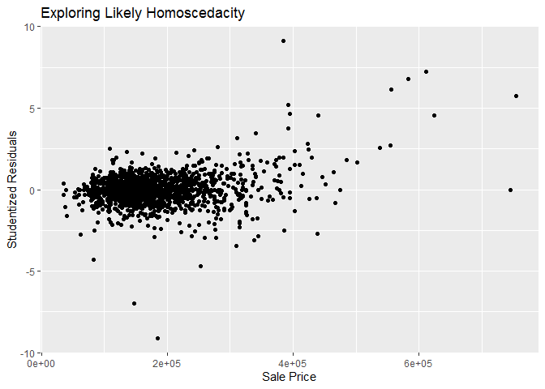
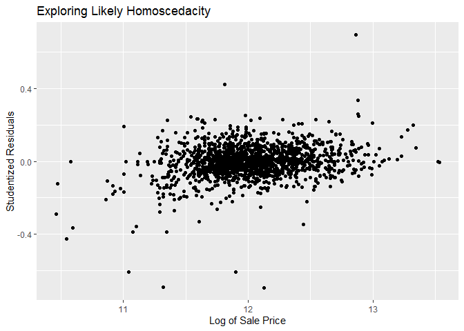
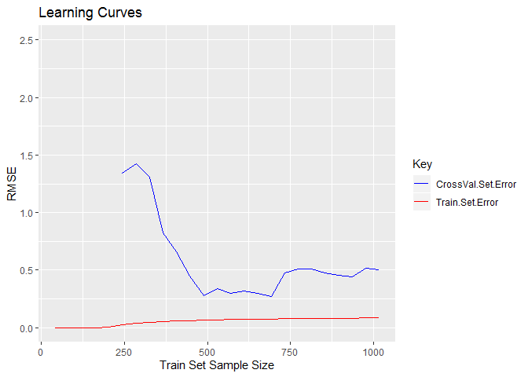

-   [Getting the Data](#getting-the-data)
-   [Identifying *Extreme* examples](#identifying-extreme-examples)
-   [Investigating Likely
    Homoscedacity](#investigating-likely-homoscedacity)
-   [Saving a Baseline](#saving-a-baseline)
-   [Learning Curves](#learning-curves)

Loading the required libraries.

Loading required functions.

    na.count = function (dat){
      dat %>% apply(., 2, is.na) %>% apply(.,2,sum) %>% .[.!=0]
    }

### Getting the Data

1.  We start by getting the previously cleaned *train* subset.

<!-- -->

    train = readRDS("./RDA/train")

### Identifying *Extreme* examples

1.  We identify *high-levarage* and *outlier* examples. To that end we
    use the following hurdles:
    1.  An example is a high-leverage point if its **leverage
        statistic** is 10 times of more than the **average leverage**
        for all observations
    2.  An example is an outlier if its **studentized residual** is
        greater than 3.
2.  We fit a linear regression model to the data and use the model
    statistics to identify the extreme examples

<!-- -->

    fit = lm(SalePrice~., data = train)

    #   Hurdle for a high leverage datapoint 
    #   Avergae high-leverage for the data-set = ((number of features)+1)/(number of examples)
    h.stat.hrdl = 10*ncol(train)/nrow(train)

    #   Hurdle for outlier point
    outlier.hrdl = 3

    res.df = data.frame(SalePrice = train$SalePrice, 
                        StndRes = fit$residuals/sd(fit$residuals), 
                        LvrgStat = hatvalues(fit))
    rownames(res.df) = rownames(train)

    res.df = res.df %>% 
        mutate(., cndt = ifelse(res.df$StndRes > outlier.hrdl & res.df$LvrgStat >= h.stat.hrdl, "Both", 
                                ifelse(res.df$StndRes > outlier.hrdl, "Outlier", 
                                       ifelse(res.df$LvrgStat >= h.stat.hrdl, "HiLeverage", "None"))))

    table(res.df$cndt)

    ## 
    ##       Both HiLeverage       None    Outlier 
    ##          1         73       1373         11

*Observations*

1.  There is 85 data point that is likely either an outlier or
    hi-leverage or both.
    1.  We consider the impact on the quality of fit after excluding
        each one of them individually from the dataset to which the
        linear model is fitted.
2.  We first establish a baseline for cross-validated estimated test
    error for the linear model using all data points. We then compare
    the improvement in this measure when each of these 82 data points
    are excluded individually and the penalised linear model is
    refitted.
3.  we use the `glmnet` package as there is a ready function to
    calculate cross-validated estimated test error.To *mimic* a
    non-penalised linear fit, we use extremely small values for the
    penalty factor lambda.
4.  We identify those candidate data points that reduce the MSE by 20%
    i.e. mean error ~10%

<!-- -->

    x = model.matrix(data = train, SalePrice~.)[,-1]
    y = train$SalePrice
    cndt = rownames(res.df[(res.df$cndt == "Outlier" | res.df$cndt == "HiLeverage"),]) %>% as.integer()

    set.seed(1970)
    cv.mse.base = cv.glmnet(x, y, lambda = c(0,10^-10))$cvm[1]

    cv.mse.cndt = data.frame(Id = cndt, MSE = c(rep(0, length(cndt))))
    i=1
    #   This loop will take some time to complete
    for (c in cndt) { 
        set.seed(1970) 
        cv.mse.cndt[i,2] = cv.glmnet(x[-c,], y[-c], lambda = c(0,10^-10))$cvm[1] 
        i = i+1
    }

    #   
    cv.mse.cndt = cv.mse.cndt %>% mutate(ratio = cv.mse.cndt$MSE/cv.mse.base)
    cv.mse.cndt = cv.mse.cndt %>% mutate(cndt = ifelse(ratio < 0.8, TRUE, FALSE))

    cv.mse.cndt[cv.mse.cndt$cndt == TRUE, c("Id", "ratio")]

    ##      Id     ratio
    ## 11  198 0.5632674
    ## 54  811 0.7626076
    ## 71 1181 0.7920161
    ## 72 1182 0.5475051

    cndt = cv.mse.cndt[cv.mse.cndt$cndt == TRUE, "Id"]
    res.df[cndt,]

    ##      SalePrice       StndRes  LvrgStat       cndt
    ## 198     235000 -2.717624e-14 1.0000000 HiLeverage
    ## 811     181000 -9.207503e-16 1.0000000 HiLeverage
    ## 1181    392500  3.748267e+00 0.1917569    Outlier
    ## 1182    745000  2.654724e-14 1.0000000 HiLeverage

*Observations*

1.  We find that 2 data points, Id nos. 1171 and 1299, when excluded
    individually from the data used to model a linear fit, reduce the
    baseline model's mean squared error by over 20% (i.e. reduce the
    error by over 10.6%). These two points should therefore be excluded
    from building any model using the train subset.
2.  Further we see that both these points are likely hi-leverage points
    which further strengthens the decision to exclude them when building
    the model.

### Investigating Likely Homoscedacity

    res.df %>% ggplot(aes(SalePrice, StndRes))+ geom_point()+ 
        labs(title = "Exploring Likely Homoscedacity", x = "Sale Price", y = "Studentized Residuals")

*Observations*

1.  As the Sale Price gets larger, the studentized residuals of the
    linear model also tend to get larger and this trend indicates
    potential heteroscedacity in the response variable.
2.  We attempt to eliminate this heteroscedacity by using the log values
    of the response variable in building the linear fit model.

<!-- -->

    fit = lm(log(SalePrice)~., data = train)
    res.df$StndRes = fit$residuals
    res.df %>% ggplot(aes(log(SalePrice), StndRes))+ geom_point()+ 
        labs(title = "Exploring Likely Homoscedacity", x = "Log of Sale Price", y = "Studentized Residuals")

*Observations*

1.  We see that the heteroscedacity in the response variable is now
    eliminated and therefore conclude that we should *use the log value
    of the response variable (Sale Price)* when building a model.
2.  We eliminate the two hi-leverage datapoints identified earlier from
    our training set and save the train subset for future use.

### Saving a Baseline

    train = train[-cndt,]
    # saveRDS(train, "./RDA/train")

### Learning Curves

Before proceeding further with feature engineering, it would be
worthwhile to draw some *Learning Curves* to determine if a basic
logistical regression model suffers from high bias or high variance.
This will inform our feature engineering better.

    #   We divide the training data into a training set and a validation set in the ratio of 70:30. We shuffle the train subset 5 times to improve our estimates for the learning curve
    lc.steps = 25
    err.train = rep(0, lc.steps); err.val = err.train

    for (k in 1:5) {
        set.seed(k)
        indx = sample(nrow(train), 0.7*nrow(train), replace = FALSE)
        lc.step.size = length(indx)/lc.steps
        lc.set.size = seq(lc.step.size, length(indx), length.out = lc.steps) %>% round(digits = 0)
        
        #   Because we are using small subsets of the train data, it is likely that for certain factor variables all levels may not be represented in the subset. This causes error in the lm() function and we therefore need to use the lower-level lm.fit() function which requires that the independent variables be provided in a model matrix format
        x = model.matrix(SalePrice~., data = train)[,-1]
        y = train$SalePrice %>% log()
        
        for (i in 1:lc.steps) {
            x.subset = x[indx[1:lc.set.size[i]],]; y.subset = y[indx[1:lc.set.size[i]]]
            fit = lm.fit(x.subset, y.subset)
            err.train[i] = err.train[i] + sqrt(mean(fit$residuals^2))
            
            fit.coeff = fit$coefficients
            fit.coeff = ifelse(is.na(fit.coeff), 0, fit.coeff)
            
            y.val = y[-indx]
            y.val.hat = x[-indx,]%*%fit.coeff %>% as.numeric()
            err.val[i] = err.val[i] + sqrt(mean((y.val.hat - y.val)^2))
        }
    }

    err.train = err.train/5; err.val = err.val/5
    err.df = cbind(Size = lc.set.size, Train = err.train, Val = err.val) %>% as.data.frame()

    err.df %>% ggplot(aes(x = Size)) + geom_line(aes(y = Train, color = "Train.Set.Error"))+ 
        geom_line(aes(y = Val, color = "CrossVal.Set.Error"))+ 
        labs(title = "Learning Curves", x = "Train Set Sample Size", y = "RMSE")+
        scale_colour_manual(name="Key", values=c(Train.Set.Error ="red", CrossVal.Set.Error ="blue"))+ 
        ylim(0, 2.5)

*Observation*

1.  The two learning curves are trending closer to each other but the
    gap is narrowing rather slowly as the size of the train subest
    incrases. This indicates that a linear regression fit is likely to
    suffer from high variance.
2.  We have two options - either increase the number of train examples
    or reduce the dimensions of the train data-set. Clearly the former
    is not an option and so we propose to use learning algorithms that
    reduce the dimensionality of the train subset.
3.  We propose to use the following learning algorithms
    1.  Ridge-penalised linear regression
    2.  Lasso-penalised linear regression
    3.  Linear regression using prinicipal components
    4.  Linear regression using partial least square
