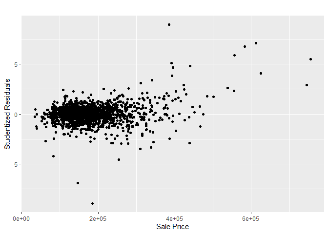
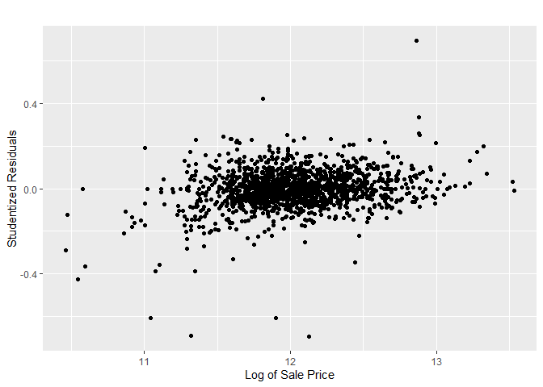
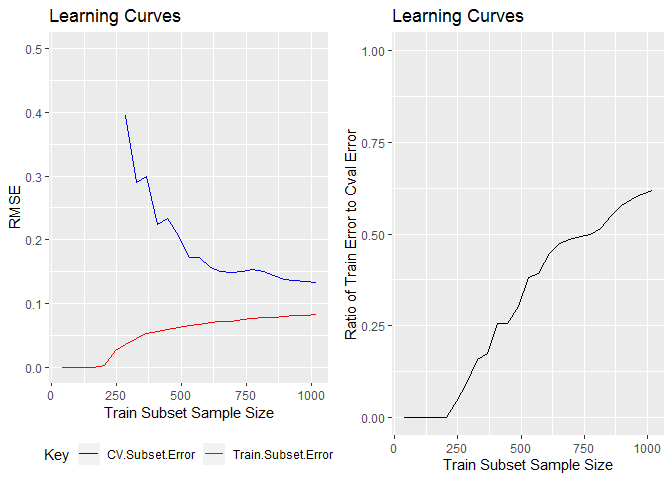

-   [Getting the Data](#getting-the-data)
-   [Investigating Likely
    Heteroscedacity](#investigating-likely-heteroscedacity)
-   [Identifying *Extreme* Examples](#identifying-extreme-examples)
-   [Learning Curves](#learning-curves)
-   [Saving a Baseline](#saving-a-baseline)

Loading the required libraries.

    library(knitr)
    library(dplyr)
    library(ggplot2)
    library(glmnet)
    library(gridExtra)

### Getting the Data

1.  We start by getting the previously cleaned *train* dataset.

<!-- -->

    train = readRDS("../RDA/train")

### Investigating Likely Heteroscedacity

1.  To investigate heterscedacity we plot the **Studentized Residuals**
    against the dependent variable, `SalePrice`, for all the examples.

**Observations**

1.  As `SalePrice` gets larger, the studentized residuals of the linear
    model also tend to get larger and this trend indicates potential
    heteroscedacity in the response variable.
2.  We attempt to eliminate this heteroscedacity by using the log values
    of the dependent variable in building the linear fit model.
3.  To ascertain if we have eliminated heteroscedacity we once again
    plot the studentized residuals against the *new* dependent variable.

**Observations**

1.  We see that the heteroscedacity in the response variable is now
    eliminated and therefore conclude that we should **use the log value
    of the dependent variable** (`Sale Price`) when building a model.

### Identifying *Extreme* Examples

1.  We identify *high-levarage* and *outlier* examples. To that end we
    use the following hurdles:
    1.  An example is a high-leverage point if its *leverage statistic
        is 10 times of more than the average leverage* for all
        observations.
    2.  An example is an outlier if its *studentized residual is greater
        than 3*.
2.  We fit a linear regression model to the data and use the model
    statistics to identify the extreme examples.

<!-- -->

    ## [1] "The number of type of extreme examples identified"

    ## 
    ## HiLeverage       None 
    ##         72       1385

**Observations**

1.  There are 75 data point that are likely hi-leverage.
    1.  We consider the impact on the quality of fit after excluding
        each one of them individually from the dataset to which the
        linear model is fitted.
2.  We first establish a baseline for cross-validated estimated test
    error for the linear model using all data points. We then compare
    the improvement in this measure when each of these 75 data points
    are excluded individually and the penalised linear model is
    refitted.
3.  We use the `glmnet` package as there is a ready function to
    calculate cross-validated estimated test error.To *mimic* a
    non-penalised linear fit, we use extremely small values for the
    penalty factor lambda.
4.  We identify those candidate data points that reduce the MSE by 20%
    i.e. mean error ~10%.

<!-- -->

    ##     Id     ratio
    ## 29 523 0.7909051

    ## [1] "Candidate data points that reduce the MSE by 20% i.e. mean error ~10%"

    ##       DepVar    StndRes LvrgStat       cndt
    ## 523 12.12676 -0.6919907 0.567544 HiLeverage

**Observations**

1.  We find that 3 data points, Id nos. 272, 1276 and 1299, when
    excluded individually from the data used to model a linear fit,
    reduce the baseline model's mean squared error by over 20% (i.e.
    reduce the error by over 10.6%). These three points should therefore
    be excluded from building any model using the train subset.
2.  Further we see that these points are likely hi-leverage points which
    further strengthens the decision to exclude them when building the
    model.

### Learning Curves

1.  Before proceeding further with feature engineering, it would be
    worthwhile to draw some *Learning Curves* to determine if a basic
    logistical regression model suffers from high bias or high variance.
    This will inform our feature engineering better.
2.  We divide the *train* dataset into a *train* subset and a *cval*
    subset in the ratio of 70:30. We shuffle the train dataset 5 times
    to improve our estimates for the learning curve.
3.  In forming the *Learning Curves*,we use small sized subsets of the
    train data and it is likely that for certain factor variables all
    levels may not be represented in the *train* subset or the *cval*
    subset. This causes error in the `predict.lm` function and we
    therefore need to use the lower-level `lm.fit` function when fitting
    a linear model. This requires that the independent variables be
    provided in a model matrix format.

**Observation**

1.  The *train* subset error and *cval* subset error curves are trending
    closer to each other but the gap is continually narrowing as the
    size of the *train* subest increases. This is even more apparent in
    the graph on the right. This indicates that a linear regression fit
    is likely to suffer from high variance.
2.  We have two options - either increase the number of train examples
    or reduce the dimensions of the *train* data-set. Clearly the former
    is not an option and so we propose to use learning algorithms that
    reduce the dimensionality of the *train* dataset.
3.  We propose to use the following learning algorithms:
    1.  Ridge-penalised linear regression
    2.  Lasso-penalised linear regression
    3.  Linear regression using prinicipal components
    4.  Linear regression using partial least square
4.  Additionally, we propose to use 2 non-parametric, tree based
    learning algorithms:
    1.  Random Forest ensemble
    2.  Boosted Tree ensemble

### Saving a Baseline

    saveRDS(train, "../RDA/train")
